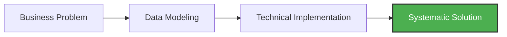

  

 

  <h2><b>Bridging Business Strategy with Technical Execution</b></h2>
  
Final-term Management & Computer Science student at Chiang Mai University, focused on data-driven decision making and process automation.

 

    
    
    
    
    

 

> [!NOTE]
> **Global Infrastructure Standard:** Most core projects below are built with a standardized **multi-language infrastructure**, providing documentation and interfaces in 5 languages (EN, TH, ZH, JA, KO) to ensure maximum accessibility and data integrity across diverse user bases.

---

### Featured Projects

#### [howmanycals](https://github.com/welltilln/howmanycals)
**AI-Powered Nutritionist LINE Bot**
*   **Role:** Product Maker & Data Integrator
*   **Impact:** Developed a production-ready vision-based AI bot that converts unstructured food images into structured nutritional data.
*   **Tech Stack:** Python, FastAPI, Google Gemini Vision API, SQLite (Persistent Memory).
*   **Key Achievement:** Implemented a persistent daily calorie tracking system with automatic midnight reset logic.

  

#### [fastapi-line-gemini](https://github.com/welltilln/fastapi-line-gemini)
**Enterprise-Grade AI Bot Boilerplate**
*   **Role:** Systems Architect
*   **Impact:** Created a scalable starter kit for integrating LLMs with messaging platforms, significantly reducing development time for AI specialized tools.
*   **Tech Stack:** Python, Docker, Ngrok, LINE Messaging API.
*   **Key Achievement:** Standardized localization across 5 languages, demonstrating meticulous content management.

#### [Yosafe](https://github.com/welltilln/yosafe)
**Financial Asset Tracking & Auditing System**
*   **Role:** Backend Engineer (Private Repo)
*   **Impact:** Built a high-precision ledger system for tracking asset movements, ensuring 100% data reliability for capital auditing.
*   **Tech Stack:** SQL (PostgreSQL), Python (TUI), Bash.

  

#### [agent-asylum](https://github.com/welltilln/agent-asylum)
**AI Agent Failure Analysis Archive**
*   **Role:** Technical Analyst
*   **Impact:** A collaborative database documenting logical deadlocks and architectural failures in autonomous AI agents.
*   **Key Achievement:** Analyzed systemic paradoxes in tool-calling workflows to improve system prompt resilience.

---

### Technical Skill Set

| Category | Skills & Tools |
| :--- | :--- |
| **Business & Strategy** | Requirements Gathering, Process Mapping (BPMN), Stakeholder Communication, System Analysis |
| **Data Analysis** | SQL (PostgreSQL/SQLite), Python (Pandas/NumPy), Data Visualization, Quantitative Analysis |
| **Development & Ops** | FastAPI, Docker & Docker Compose, Bash Scripting, Version Control (Git), API Integration |
| **AI & Automation** | LLM Implementation (Gemini/GPT), Multi-language Support Systems, Webhook Management |

---

### GitHub Metrics

  
  

---

### The Methodology

  
<i>Leveraging data and technology to build scalable, structural solutions.</i>

  
<b>Interested in working together?</b> Let's connect on <a href="https://www.linkedin.com/in/welltilln/">LinkedIn</a>

