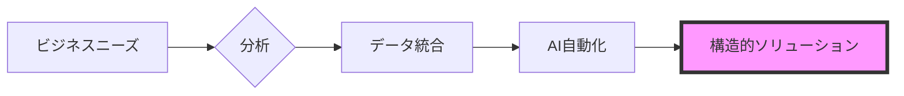

  

 

  <h2><b>ビジネス戦略と技術実行の橋渡し</b></h2>
  
チェンマイ大学 経営学・コンピュータサイエンス専攻。データ駆動型意思決定とプロセス自動化を専門としています。

 

    
    
    
    
    

 

> [!NOTE]
> **Global Infrastructure Standard:** 以下の主要プロジェクトの多くは、**標準化された多言語インフラストラクチャ**で構築されており、5言語（EN, TH, ZH, JA, KO）でドキュメントとインターフェースを提供しています。

---

### 注目のプロジェクト

#### [howmanycals](https://github.com/welltilln/howmanycals)
**AI搭載栄養士LINEボット**
*   **役割:** プロダクトメーカー ＆ データインテグレーター
*   **インパクト:** 非構造化された食事画像を構造化された栄養データに変換する、実運用可能なビジョンベースAIボットを開発。
*   **技術スタック:** Python, FastAPI, Google Gemini Vision API, SQLite (Persistent Memory)
*   **主な成果:** 永続的な日次カロリー追跡システムと自動リセットロジックの実装。

  

#### [fastapi-line-gemini](https://github.com/welltilln/fastapi-line-gemini)
**エンタープライズ向けAIボットボイラープレート**
*   **役割:** システムアーキテクト
*   **インパクト:** LLMをメッセージングプラットフォームに統合するためのスケーラブルなスターターキットを作成し、AIツールの開発時間を大幅に短縮。
*   **技術スタック:** Python, Docker, Ngrok, LINE Messaging API
*   **主な成果:** 5言語にわたるローカリゼーションの標準化。

#### [Yosafe](https://github.com/welltilln/yosafe)
**財務資産追跡・監査システム**
*   **役割:** バックエンドエンジニア (プライベートリポジトリ)
*   **インパクト:** 資産の動きを追跡するための高精度な台帳システムを構築し、監査のためのデータ信頼性100%を保証。
*   **技術スタック:** SQL (PostgreSQL), Python (TUI), Bash

  

#### [agent-asylum](https://github.com/welltilln/agent-asylum)
**AIエージェント障害分析アーカイブ**
*   **役割:** テクニカルアナリスト
*   **インパクト:** 自律型AIエージェントにおけるロジカルデッドロックやアーキテクチャ上の失敗を記録する共同データベース。
*   **主な成果:** ツール呼び出しワークフローにおけるシステム的なパラドックスを分析し、レジリエンスを向上。

   

<h1 align="center">スキル (Skills)</h1>

<table align="center" width="100%">
  <tr>
    <td width="33%" valign="top">
      <h3>ビジネス</h3>
      <ul>
        <li>ビジネスプロセス分析</li>
        <li>要件定義</li>
        <li>システム分析・設計</li>
        <li>運用管理</li>
      </ul>
    </td>
    <td width="33%" valign="top">
      <h3>データ</h3>
      <ul>
        <li>Python (Pandas)</li>
        <li>SQL (PostgreSQL / SQLite)</li>
        <li>計量分析</li>
        <li>データ統合</li>
      </ul>
    </td>
    <td width="33%" valign="top">
      <h3>テクニカル</h3>
      <ul>
        <li>FastAPI</li>
        <li>Docker</li>
        <li>Bashスクリプティング</li>
        <li>LLM API統合</li>
      </ul>
    </td>
  </tr>
</table>

   

<h1 align="center">GitHubアクティビティ</h1>

  
  
   
  

  

<h1 align="center">The Builder Workflow</h1>

  

<i>経営とデータの交差点で構造的ソリューションを構築する。</i>

