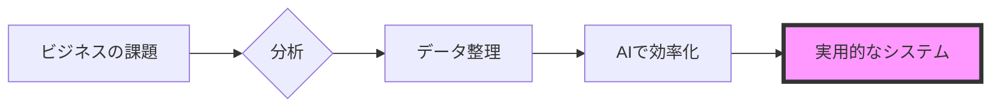

  

 

  <h2><b>データと技術でビジネスの課題を解く</b></h2>
  
チェンマイ大学 経営学・コンピュータサイエンス専攻 4年。実データに基づく意思決定と、業務を自動化する仕組みづくりに取り組んでいます。

 

    
    
    
    
    

 

> [!NOTE]
> **Global Infrastructure Standard:** 以下の主要プロジェクトは、最初から5言語（EN, TH, ZH, JA, KO）のドキュメントとUIを備えています。正確な情報は、読み手の言語で伝えてこそ意味があると考えているからです。

---

### 主なプロジェクト

#### [howmanycals](https://github.com/welltilln/howmanycals)
**AI栄養士 LINE Bot**
*   **概要:** 食事の写真を撮るだけでカロリーがわかるLINE Bot。Gemini Visionで画像を解析し、栄養データとして構造的に出力します。
*   **技術:** Python, FastAPI, Google Gemini Vision API, SQLite
*   **特徴:** 1日の累計カロリーを記録し、深夜0時に自動リセット。日常的に使える実用ツールです。

  

#### [fastapi-line-gemini](https://github.com/welltilln/fastapi-line-gemini)
**LINE Bot + AI のスターターキット**
*   **概要:** LLMとLINE Botの連携をゼロから書かなくて済むように設計したテンプレート。コードの拡張性を重視しています。
*   **技術:** Python, Docker, Ngrok, LINE Messaging API
*   **特徴:** ドキュメントとBot本体の両方が最初から5言語対応。

#### [Yosafe](https://github.com/welltilln/yosafe)
**資産記録・監査システム**
*   **概要:** 資金やアセットの動きをすべて記録し、どの取引でも遡って検証できる個人用台帳。データの正確性100%を設計方針としています。
*   **技術:** SQL (PostgreSQL), Python (TUI), Bash

  

#### [agent-asylum](https://github.com/welltilln/agent-asylum)
**AIエージェント障害記録**
*   **概要:** AIエージェントがロジックの矛盾で動けなくなったり、設計上の欠陥で壊れたケースを記録・分析するデータベース。
*   **特徴:** Tool呼び出しフローの構造的な矛盾を分析し、System Promptの改善に活用。

   

<h1 align="center">スキル</h1>

<table align="center" width="100%">
  <tr>
    <td width="33%" valign="top">
      <h3>ビジネス</h3>
      <ul>
        <li>業務フロー分析</li>
        <li>要件定義</li>
        <li>システム設計</li>
        <li>部門横断の調整</li>
        <li>Business Research</li>
        <li>Linear Programming</li>
      </ul>
    </td>
    <td width="33%" valign="top">
      <h3>データ</h3>
      <ul>
        <li>Python (Pandas / NumPy)</li>
        <li>SQL (PostgreSQL / SQLite)</li>
        <li>Power BI</li>
        <li>定量分析</li>
        <li>複数ソースのデータ統合</li>
      </ul>
    </td>
    <td width="33%" valign="top">
      <h3>技術</h3>
      <ul>
        <li>FastAPI / Docker</li>
        <li>Linux Administration</li>
        <li>Bash Scripting</li>
        <li>VAPT / Network Security</li>
        <li>LLM API連携 (Gemini, GPT)</li>
      </ul>
    </td>
  </tr>
  <tr>
    <td width="33%" valign="top">
      <h3>ソフトウェア</h3>
      <ul>
        <li>Microsoft Excel / Word / PowerPoint</li>
        <li>Canva</li>
        <li>DaVinci Resolve</li>
        <li>Git / GitHub</li>
      </ul>
    </td>
    <td width="33%" valign="top">
      <h3>AIツール</h3>
      <ul>
        <li>ChatGPT / Claude / Gemini</li>
        <li>AI Coding Assistant</li>
        <li>AI画像生成</li>
        <li>Prompt Engineering</li>
      </ul>
    </td>
    <td width="33%" valign="top">
      <h3>Soft Skills</h3>
      <ul>
        <li>EQが高く、プレッシャー下でも冷静</li>
        <li>Pragmaticな問題解決</li>
        <li>英語C1レベル</li>
      </ul>
    </td>
  </tr>
</table>

   

<h1 align="center">GitHubの記録</h1>

  
  
   
  

  

<h1 align="center">仕事の進め方</h1>

  

<i>実際の課題を、実際のデータで、実際に使えるシステムとして解決する。</i>

