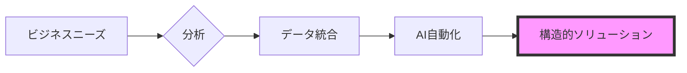

  

 

    
    
    
    
    

  <h2><b>チェンマイ大学 経営学・コンピュータサイエンス専攻</b></h2>
  
ビジネスプロセスの自動化とデータ駆動型分析への体系的なアプローチ。

 

### howmanycals

Google Gemini Visionを活用して食事画像をスキャンし、正確なカロリーを抽出するAI搭載のLINE公式アカウント（個人栄養士）。
* **技術:** Python, FastAPI, Google Gemini API, LINE Messaging API.
* **実装:** 画像Webhookを受信し、マルチモーダルAIモデルを使用して構造化された栄養データを返します。

  

**[リポジトリを表示](https://github.com/welltilln/howmanycals)**

---

### fastapi-line-gemini

Gemini AIを統合したLINEボット作成のためのボイラープレートリポジトリ。
* **目的:** 適切な環境設定とAPI処理を備えた、メッセージングベースのAIツール構築の開始点を提供します。

**[リポジトリを表示](https://github.com/welltilln/fastapi-line-gemini)**

---

### Yosafe

資産移動と財務取引ログを追跡するための個人用ツール。
* **特徴:** 資本資産の集中管理のために、PostgreSQLバックエンドを使用して高精度データを処理するように構築されています。

  

*プライベートリポジトリ*

---

### 市場分析ツール (Market Analysis Tools)

論理ベースの検出を使用して市場構造と価格アクションのトレンドを分析するための計量スクリプト。

*プライベートリポジトリ*

   

<h1 align="center">スキル (Skills)</h1>

<table align="center" width="100%">
  <tr>
    <td width="33%" valign="top">
      <h3>ビジネス</h3>
      <ul>
        <li>ビジネスプロセス分析</li>
        <li>要件定義</li>
        <li>システム分析・設計</li>
        <li>運用管理</li>
      </ul>
    </td>
    <td width="33%" valign="top">
      <h3>データ</h3>
      <ul>
        <li>Python (Pandas)</li>
        <li>SQL (PostgreSQL / SQLite)</li>
        <li>計量分析</li>
        <li>データ統合</li>
      </ul>
    </td>
    <td width="33%" valign="top">
      <h3>テクニカル</h3>
      <ul>
        <li>FastAPI</li>
        <li>Docker</li>
        <li>Bashスクリプティング</li>
        <li>LLM API統合</li>
      </ul>
    </td>
  </tr>
</table>

   

<h1 align="center">GitHubアクティビティ</h1>

  
  
   
  

  

<h1 align="center">The Builder Workflow</h1>

  

<i>経営とデータの交差点で構造的ソリューションを構築する。</i>

