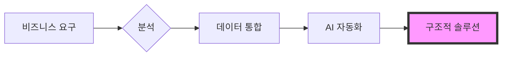

  

 

  <h2><b>비즈니스 전략과 기술적 실행의 가교</b></h2>
  
치앙마이 대학교 경영 및 컴퓨터 사이언스 전공. 데이터 기반 의사결정과 프로세스 자동화에 집중하고 있습니다.

 

    
    
    
    
    

 

> [!NOTE]
> **Global Infrastructure Standard:** 아래의 주요 프로젝트들은 **표준화된 다국어 인프라**를 기반으로 구축되었으며, 5개 언어(EN, TH, ZH, JA, KO)로 문서와 인터페이스를 제공하여 글로벌 접근성과 데이터 무결성을 보장합니다.

---

### 주요 프로젝트

#### [howmanycals](https://github.com/welltilln/howmanycals)
**AI 기반 영양사 LINE 봇**
*   **역할:** 프로덕트 메이커 및 데이터 인티그레이터
*   **임팩트:** 비구조화된 음식 이미지를 구조화된 영양 데이터로 변환하는 실무용 비전 AI 봇 개발.
*   **기술 스택:** Python, FastAPI, Google Gemini Vision API, SQLite (Persistent Memory)
*   **주요 성과:** 일일 칼로리 추적 시스템 및 자정 자동 리셋 로직 구현.

  

#### [fastapi-line-gemini](https://github.com/welltilln/fastapi-line-gemini)
**엔터프라이즈급 AI 봇 보일러플레이트**
*   **역할:** 시스템 아키텍트
*   **임팩트:** LLM을 메시징 플랫폼에 통합하기 위한 확장 가능한 스타터 키트를 제작하여 AI 도구 개발 시간을 크게 단축.
*   **기술 스택:** Python, Docker, Ngrok, LINE Messaging API
*   **주요 성과:** 5개 언어 로컬라이제이션 표준화.

#### [Yosafe](https://github.com/welltilln/yosafe)
**금융 자산 추적 및 감사 시스템**
*   **역할:** 백엔드 엔지니어 (비공개 저장소)
*   **임팩트:** 자산 이동을 추적하기 위한 고정밀 장부 시스템을 구축하여 감사 기준 100% 데이터 신뢰성 확보.
*   **기술 스택:** SQL (PostgreSQL), Python (TUI), Bash

  

#### [agent-asylum](https://github.com/welltilln/agent-asylum)
**AI 에이전트 장애 분석 아카이브**
*   **역할:** 기술 분석가
*   **임팩트:** 자율형 AI 에이전트의 논리적 데드락 및 아키텍처 장애를 기록하는 협업 데이터베이스.
*   **주요 성과:** 툴 호출 워크플로우의 시스템적 파라독스를 분석하여 시스템 프롬프트의 복원력 향상.

   

<h1 align="center">기술 스택 (Skills)</h1>

<table align="center" width="100%">
  <tr>
    <td width="33%" valign="top">
      <h3>비즈니스</h3>
      <ul>
        <li>비즈니스 프로세스 분석</li>
        <li>요구사항 수집</li>
        <li>시스템 분석 및 설계</li>
        <li>운영 관리</li>
      </ul>
    </td>
    <td width="33%" valign="top">
      <h3>데이터</h3>
      <ul>
        <li>Python (Pandas)</li>
        <li>SQL (PostgreSQL / SQLite)</li>
        <li>정량 분석</li>
        <li>데이터 통합</li>
      </ul>
    </td>
    <td width="33%" valign="top">
      <h3>기술</h3>
      <ul>
        <li>FastAPI</li>
        <li>Docker</li>
        <li>Bash 스크립팅</li>
        <li>LLM API 통합</li>
      </ul>
    </td>
  </tr>
</table>

   

<h1 align="center">GitHub 활동</h1>

  
  
   
  

  

<h1 align="center">The Builder Workflow</h1>

  

<i>경영과 데이터의 교차점에서 구조적 솔루션을 구축함.</i>

