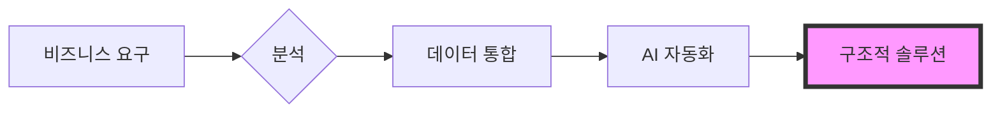

  

 

    
    
    
    
    

  <h2><b>치앙마이 대학교 경영 및 컴퓨터 사이언스 전공</b></h2>
  
비즈니스 프로세스 자동화 및 데이터 기반 분석에 대한 체계적인 접근 방식.

 

### howmanycals

Google Gemini Vision을 사용하여 음식 이미지를 스캔하고 정확한 칼로리를 추출하는 AI 기반 LINE 공식 계정(개인 영양사).
* **기술:** Python, FastAPI, Google Gemini API, LINE Messaging API.
* **구현:** 이미지 웹훅을 수신하고 멀티모달 AI 모델을 사용하여 구조화된 영양 데이터를 반환합니다.

  

**[리포지토리 보기](https://github.com/welltilln/howmanycals)**

---

### fastapi-line-gemini

Gemini AI가 통합된 LINE 봇 제작을 위한 보일러플레이트 리포지토리.
* **목적:** 적절한 환경 설정 및 API 처리를 갖춘 메시징 기반 AI 도구 구축의 시작점을 제공합니다.

**[리포지토리 보기](https://github.com/welltilln/fastapi-line-gemini)**

---

### Yosafe

자산 이동 및 재무 거래 로그를 추적하기 위한 개인 도구.
* **기능:** 자본 자산의 중앙 집중식 정보 소스를 유지하기 위해 PostgreSQL 백엔드를 사용하여 고정밀 데이터를 처리하도록 구축되었습니다.

  

*비공개 리포지토리*

---

### 시장 분석 도구 (Market Analysis Tools)

로직 기반 탐지를 사용하여 시장 구조 및 가격 액션 추세를 분석하기 위한 정량적 스크립트.

*비공개 리포지토리*

   

<h1 align="center">기술 스택 (Skills)</h1>

<table align="center" width="100%">
  <tr>
    <td width="33%" valign="top">
      <h3>비즈니스</h3>
      <ul>
        <li>비즈니스 프로세스 분석</li>
        <li>요구사항 수집</li>
        <li>시스템 분석 및 설계</li>
        <li>운영 관리</li>
      </ul>
    </td>
    <td width="33%" valign="top">
      <h3>데이터</h3>
      <ul>
        <li>Python (Pandas)</li>
        <li>SQL (PostgreSQL / SQLite)</li>
        <li>정량 분석</li>
        <li>데이터 통합</li>
      </ul>
    </td>
    <td width="33%" valign="top">
      <h3>기술</h3>
      <ul>
        <li>FastAPI</li>
        <li>Docker</li>
        <li>Bash 스크립팅</li>
        <li>LLM API 통합</li>
      </ul>
    </td>
  </tr>
</table>

   

<h1 align="center">GitHub 활동</h1>

  
  
   
  

  

<h1 align="center">The Builder Workflow</h1>

  

<i>경영과 데이터의 교차점에서 구조적 솔루션을 구축함.</i>

