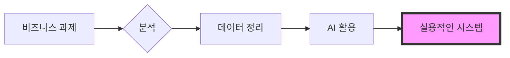

  

 

  <h2><b>데이터와 기술로 비즈니스 문제를 해결합니다</b></h2>
  
치앙마이 대학교 경영학 및 컴퓨터 사이언스 4학년. 실제 데이터를 바탕으로 의사결정을 내리고, 반복적인 업무를 자동화하는 시스템을 만들고 있습니다.

 

    
    
    
    
    

 

> [!NOTE]
> **Global Infrastructure Standard:** 아래 주요 프로젝트들은 처음부터 5개 언어(EN, TH, ZH, JA, KO)로 문서와 UI를 갖추고 있습니다. 정확한 정보는 읽는 사람의 언어로 전달되어야 의미가 있다고 생각하기 때문입니다.

---

### 주요 프로젝트

#### [howmanycals](https://github.com/welltilln/howmanycals)
**AI 영양사 LINE Bot**
*   **소개:** 음식 사진을 찍으면 칼로리를 바로 알려주는 LINE Bot. Gemini Vision으로 이미지를 분석해 영양 데이터를 구조화하여 출력합니다.
*   **기술:** Python, FastAPI, Google Gemini Vision API, SQLite
*   **특징:** 하루 누적 칼로리를 기록하고 자정에 자동 리셋. 실생활에서 매일 쓸 수 있는 도구입니다.

  

#### [fastapi-line-gemini](https://github.com/welltilln/fastapi-line-gemini)
**LINE Bot + AI 스타터 키트**
*   **소개:** LLM과 LINE Bot 연동을 처음부터 작성할 필요 없도록 설계한 템플릿. 코드 확장성을 중심으로 구조화했습니다.
*   **기술:** Python, Docker, Ngrok, LINE Messaging API
*   **특징:** 문서와 Bot 모두 처음부터 5개 언어 지원.

#### [Yosafe](https://github.com/welltilln/yosafe)
**자산 기록 및 감사 시스템**
*   **소개:** 자금과 자산의 움직임을 전부 기록하고, 어떤 거래든 소급해서 검증할 수 있는 개인용 장부. 데이터 정확도 100%가 설계 원칙입니다.
*   **기술:** SQL (PostgreSQL), Python (TUI), Bash

  

#### [agent-asylum](https://github.com/welltilln/agent-asylum)
**AI 에이전트 장애 기록**
*   **소개:** AI 에이전트가 논리적 모순으로 멈추거나 설계 결함으로 고장 난 사례를 기록하고 분석하는 데이터베이스.
*   **특징:** Tool 호출 흐름의 구조적 모순을 분석하여 System Prompt 개선에 활용.

   

<h1 align="center">기술 스택</h1>

<table align="center" width="100%">
  <tr>
    <td width="33%" valign="top">
      <h3>비즈니스</h3>
      <ul>
        <li>업무 프로세스 분석</li>
        <li>요구사항 정의</li>
        <li>시스템 설계</li>
        <li>부서 간 협업 조율</li>
        <li>Business Research</li>
        <li>Linear Programming</li>
      </ul>
    </td>
    <td width="33%" valign="top">
      <h3>데이터</h3>
      <ul>
        <li>Python (Pandas / NumPy)</li>
        <li>SQL (PostgreSQL / SQLite)</li>
        <li>Power BI</li>
        <li>정량 분석</li>
        <li>다중 소스 데이터 통합</li>
      </ul>
    </td>
    <td width="33%" valign="top">
      <h3>기술</h3>
      <ul>
        <li>FastAPI / Docker</li>
        <li>Linux Administration</li>
        <li>Bash Scripting</li>
        <li>VAPT / Network Security</li>
        <li>LLM API 연동 (Gemini, GPT)</li>
      </ul>
    </td>
  </tr>
  <tr>
    <td width="33%" valign="top">
      <h3>소프트웨어</h3>
      <ul>
        <li>Microsoft Excel / Word / PowerPoint</li>
        <li>Canva</li>
        <li>DaVinci Resolve</li>
        <li>Git / GitHub</li>
      </ul>
    </td>
    <td width="33%" valign="top">
      <h3>AI 도구</h3>
      <ul>
        <li>ChatGPT / Claude / Gemini</li>
        <li>AI Coding Assistant</li>
        <li>AI 이미지 생성</li>
        <li>Prompt Engineering</li>
      </ul>
    </td>
    <td width="33%" valign="top">
      <h3>Soft Skills</h3>
      <ul>
        <li>EQ가 높고 압박 속에서도 침착</li>
        <li>Pragmatic 문제 해결</li>
        <li>영어 C1 수준</li>
      </ul>
    </td>
  </tr>
</table>

   

<h1 align="center">GitHub 활동</h1>

  
  
   
  

  

<h1 align="center">일하는 방식</h1>

  

<i>실제 문제를 실제 데이터로, 실제로 쓸 수 있는 시스템으로 해결합니다.</i>

