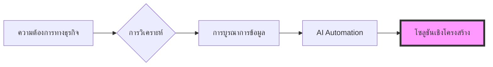

  

 

  <h2><b>เชื่อมโยงกลยุทธ์ทางธุรกิจเข้ากับการดำเนินงานทางเทคนิค</b></h2>
  
นักศึกษาชั้นปีสุดท้าย สาขา Management และ Computer Science มหาวิทยาลัยเชียงใหม่ มุ่งเน้นการตัดสินใจด้วยข้อมูลและการสร้างระบบอัตโนมัติ

 

    
    
    
    
    

 

> [!NOTE]
> **Global Infrastructure Standard:** โปรเจคหลักส่วนใหญ่สร้างขึ้นด้วย **โครงสร้างพื้นฐานที่รองรับหลายภาษา (Multi-language Infrastructure)** โดยมีเอกสารและหน้าจอนำเสนอใน 5 ภาษา (EN, TH, ZH, JA, KO) เพื่อให้เข้าถึงได้ง่ายและรักษาความถูกต้องของข้อมูลในระดับสากล

---

### โปรเจคที่โดดเด่น

#### [howmanycals](https://github.com/welltilln/howmanycals)
**LINE Bot นักโภชนาการพลัง AI**
*   **บทบาท:** Product Maker และ Data Integrator
*   **ผลลัพธ์:** พัฒนา AI Bot สำหรับใช้งานจริงที่สามารถเปลี่ยนรูปภาพอาหารที่ไม่มีโครงสร้างให้เป็นข้อมูลโภชนาการที่มีโครงสร้างชัดเจน
*   **เทคโนโลยี:** Python, FastAPI, Google Gemini Vision API, SQLite (Persistent Memory)
*   **ความสำเร็จหลัก:** ระบบติดตามแคลอรี่รายวันและระบบรีเซ็ตข้อมูลอัตโนมัติเมื่อสิ้นสุดวัน

  

#### [fastapi-line-gemini](https://github.com/welltilln/fastapi-line-gemini)
**Enterprise-Grade AI Bot Boilerplate**
*   **บทบาท:** Systems Architect
*   **ผลลัพธ์:** สร้างชุดเริ่มต้นที่สามารถขยายขีดความสามารถได้ (Scalable) สำหรับการนำ LLM มาใช้กับแพลตฟอร์มรับส่งข้อความ ช่วยลดเวลาในการพัฒนาเครื่องมือ AI เฉพาะทาง
*   **เทคโนโลยี:** Python, Docker, Ngrok, LINE Messaging API
*   **ความสำเร็จหลัก:** การจัดการ Localization 5 ภาษาอย่างเป็นระบบ แสดงถึงความใส่ใจในการจัดการเนื้อหา

#### [Yosafe](https://github.com/welltilln/yosafe)
**ระบบติดตามและตรวจสอบทรัพย์สินทางการเงิน**
*   **บทบาท:** Backend Engineer (Repository ส่วนตัว)
*   **ผลลัพธ์:** สร้างระบบบัญชีที่มีความแม่นยำสูงสำหรับการติดตามการเคลื่อนไหวของสินทรัพย์ มั่นใจในความถูกต้องของข้อมูล 100% สำหรับการตรวจสอบ
*   **เทคโนโลยี:** SQL (PostgreSQL), Python (TUI), Bash

  

#### [agent-asylum](https://github.com/welltilln/agent-asylum)
**คลังข้อมูลวิเคราะห์ความล้มเหลวของ AI Agent**
*   **บทบาท:** Technical Analyst
*   **ผลลัพธ์:** ฐานข้อมูลร่วมที่รวบรวมเหตุการณ์ Logical Deadlock และความล้มเหลวทางสถาปัตยกรรมของ AI Agent แบบอัตโนมัติ
*   **ความสำเร็จหลัก:** วิเคราะห์ความขัดแย้งเชิงระบบในกระบวนการ Tool-calling เพื่อเพิ่มความแข็งแกร่งให้กับ System Prompt

   

<h1 align="center">ทักษะ</h1>

<table align="center" width="100%">
  <tr>
    <td width="33%" valign="top">
      <h3>ธุรกิจ (Business)</h3>
      <ul>
        <li>วิเคราะห์กระบวนการทางธุรกิจ</li>
        <li>รวบรวมความต้องการ (Requirements)</li>
        <li>วิเคราะห์และออกแบบระบบ</li>
        <li>การจัดการการดำเนินงาน</li>
      </ul>
    </td>
    <td width="33%" valign="top">
      <h3>ข้อมูล (Data)</h3>
      <ul>
        <li>Python (Pandas)</li>
        <li>SQL (PostgreSQL / SQLite)</li>
        <li>การวิเคราะห์เชิงปริมาณ</li>
        <li>การบูรณาการข้อมูล</li>
      </ul>
    </td>
    <td width="33%" valign="top">
      <h3>ด้านเทคนิค (Technical)</h3>
      <ul>
        <li>FastAPI</li>
        <li>Docker</li>
        <li>Bash Scripting</li>
        <li>การเชื่อมต่อ LLM API</li>
      </ul>
    </td>
  </tr>
</table>

   

<h1 align="center">สถิติ GitHub</h1>

  
  
   
  

  

<h1 align="center">The Builder Workflow</h1>

  

<i>สร้างโซลูชันเชิงโครงสร้างที่จุดตัดระหว่างการจัดการและข้อมูล</i>

