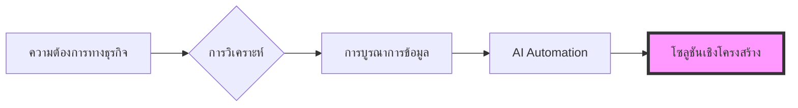

  

 

    
    
    
    
    

  <h2><b>Management and Computer Science at Chiang Mai University</b></h2>
  
แนวทางการเพิ่มประสิทธิภาพกระบวนการทางธุรกิจโดยใช้ข้อมูลเป็นศูนย์กลาง

 

### howmanycals

LINE Official Account พลัง AI ที่ทำหน้าที่เป็นนักโภชนาการส่วนตัว โดยใช้ Google Gemini Vision เพื่อสแกนภาพอาหารและคำนวณแคลอรี่ที่แม่นยำ
* **เทคโนโลยี:** Python, FastAPI, Google Gemini API, LINE Messaging API.
* **การทำงาน:** รับ Webhook ภาพและประมวลผลโดยใช้ Multimodal AI เพื่อส่งกลับข้อมูลโภชนาการที่มีโครงสร้างชัดเจน

  

**[ดู Repository](https://github.com/welltilln/howmanycals)**

---

### fastapi-line-gemini

Boilerplate สำหรับสร้าง LINE Bot ที่ทำงานร่วมกับ Gemini AI
* **จุดประสงค์:** เป็นจุดเริ่มต้นสำหรับการสร้างเครื่องมือ AI บนระบบส่งข้อความ พร้อมการตั้งค่า Environment และการจัดการ API ที่สมบูรณ์

**[ดู Repository](https://github.com/welltilln/fastapi-line-gemini)**

---

### Yosafe

เครื่องมือส่วนตัวสำหรับติดตามการเคลื่อนไหวของสินทรัพย์และบันทึกรายการทางการเงิน
* **ฟีเจอร์:** สร้างขึ้นเพื่อจัดการข้อมูลความแม่นยำสูงด้วย PostgreSQL Backend เพื่อเป็นศูนย์กลางข้อมูลของสินทรัพย์ทุน

  

*Repository ส่วนตัว*

---

### Market Analysis Tools

สคริปต์เชิงปริมาณ (Quantitative) สำหรับวิเคราะห์โครงสร้างตลาดและแนวโน้มราคาโดยใช้ตรรกะในการตรวจจับ

*Repository ส่วนตัว*

   

<h1 align="center">ทักษะ (Skills)</h1>

<table align="center" width="100%">
  <tr>
    <td width="33%" valign="top">
      <h3>ธุรกิจ (Business)</h3>
      <ul>
        <li>วิเคราะห์กระบวนการทางธุรกิจ</li>
        <li>รวบรวมความต้องการ (Requirements)</li>
        <li>วิเคราะห์และออกแบบระบบ</li>
        <li>การจัดการการดำเนินงาน</li>
      </ul>
    </td>
    <td width="33%" valign="top">
      <h3>ข้อมูล (Data)</h3>
      <ul>
        <li>Python (Pandas)</li>
        <li>SQL (PostgreSQL / SQLite)</li>
        <li>การวิเคราะห์เชิงปริมาณ</li>
        <li>การบูรณาการข้อมูล</li>
      </ul>
    </td>
    <td width="33%" valign="top">
      <h3>ด้านเทคนิค (Technical)</h3>
      <ul>
        <li>FastAPI</li>
        <li>Docker</li>
        <li>Bash Scripting</li>
        <li>การเชื่อมต่อ LLM API</li>
      </ul>
    </td>
  </tr>
</table>

   

<h1 align="center">สถิติ GitHub</h1>

  
  
   
  

  

<h1 align="center">The Builder Workflow</h1>

  

<i>สร้างโซลูชันเชิงโครงสร้างที่จุดตัดระหว่างการจัดการและข้อมูล</i>

