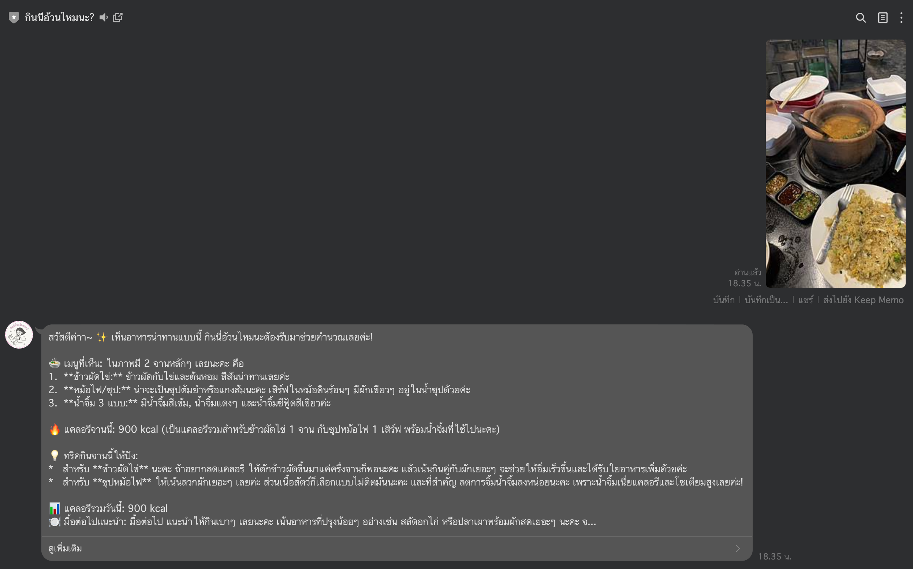
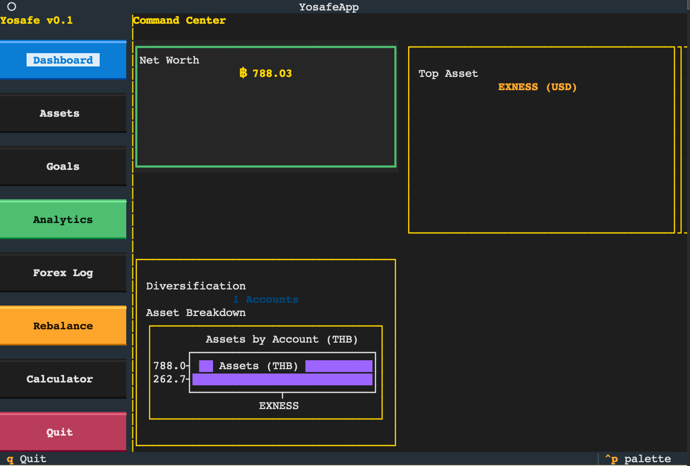
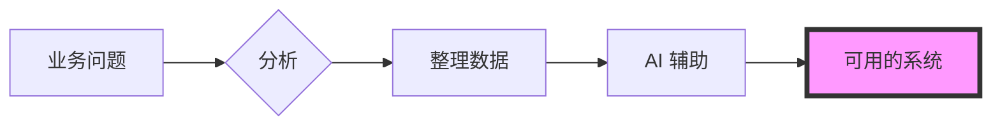

  

 

  <h2><b>用数据和技术解决实际的业务问题</b></h2>
  
清迈大学管理学与计算机科学大四学生。关注基于真实数据的决策分析，以及能替代重复性工作的自动化系统。

 

    
    
    
    
    

 

> [!NOTE]
> **Global Infrastructure Standard:** 以下核心项目从一开始就提供 5 种语言（英、泰、中、日、韩）的文档和界面。因为我认为，准确的信息只有用读者的语言传达才有意义。

---

### 简介

清迈大学工商管理学院学生，跨学院修读 CS。英语 C1 水平，持有 2 项网络安全认证。曾担任大型音乐节技术制作负责人，也为上市公司做过数据库咨询。现在寻找能同时发挥业务理解和技术能力的 BA/DA 岗位。

---

### 主要项目

#### [howmanycals](https://github.com/welltilln/howmanycals)
**AI 营养师 LINE Bot**
*   **简介：** 拍张食物照片就能告诉你卡路里的 LINE Bot。通过 Gemini Vision 分析图像，输出结构化的营养数据。
*   **技术：** Python, FastAPI, Google Gemini Vision API, SQLite
*   **亮点：** 记录每天累计卡路里，零点自动归零。是一个日常真正在用的工具。

  

#### [fastapi-line-gemini](https://github.com/welltilln/fastapi-line-gemini)
**LINE Bot + AI 现成模板**
*   **简介：** 为想要把 LLM 接入 LINE Bot 的人设计的模板，不用从零开始写。代码结构方便后续扩展。
*   **技术：** Python, Docker, Ngrok, LINE Messaging API
*   **亮点：** 文档和 Bot 本身从第一天起就支持 5 种语言。

#### [Yosafe](https://github.com/welltilln/yosafe)
**资产记录与审计系统**
*   **简介：** 记录所有资金和资产的流动情况，任何一笔交易都可以追溯验证的个人账本。设计原则是数据准确率必须达到 100%。
*   **技术：** SQL (PostgreSQL), Python (TUI), Bash

  

#### [agent-asylum](https://github.com/welltilln/agent-asylum)
**AI Agent 故障记录**
*   **简介：** 记录并分析 AI Agent 因逻辑矛盾而卡死、或因设计缺陷而崩溃的案例。
*   **亮点：** 分析了 Tool 调用流程中的结构性矛盾，用于改进 System Prompt 的稳定性。

   

<h1 align="center">技能</h1>

<table align="center" width="100%">
  <tr>
    <td width="33%" valign="top">
      <h3>业务</h3>
      <ul>
        <li>业务流程分析</li>
        <li>需求定义</li>
        <li>系统设计</li>
        <li>跨部门协调</li>
        <li>Business Research</li>
        <li>Linear Programming</li>
      </ul>
    </td>
    <td width="33%" valign="top">
      <h3>数据</h3>
      <ul>
        <li>Python (Pandas / NumPy)</li>
        <li>SQL (PostgreSQL / SQLite)</li>
        <li>Power BI</li>
        <li>定量分析</li>
        <li>多源数据整合</li>
      </ul>
    </td>
    <td width="33%" valign="top">
      <h3>技术</h3>
      <ul>
        <li>FastAPI / Docker</li>
        <li>Linux Administration</li>
        <li>Bash Scripting</li>
        <li>VAPT / Network Security</li>
        <li>LLM API 对接 (Gemini, GPT)</li>
      </ul>
    </td>
  </tr>
  <tr>
    <td width="33%" valign="top">
      <h3>软件</h3>
      <ul>
        <li>Microsoft Excel / Word / PowerPoint</li>
        <li>Canva</li>
        <li>DaVinci Resolve</li>
        <li>Git / GitHub</li>
      </ul>
    </td>
    <td width="33%" valign="top">
      <h3>AI 工具</h3>
      <ul>
        <li>ChatGPT / Claude / Gemini</li>
        <li>AI Coding Assistant</li>
        <li>AI 图像生成</li>
        <li>Prompt Engineering</li>
      </ul>
    </td>
    <td width="33%" valign="top">
      <h3>Soft Skills</h3>
      <ul>
        <li>高EQ，压力下保持冷静</li>
        <li>Pragmatic 问题解决</li>
        <li>英语C1水平</li>
        <li>网络安全认证 2 项</li>
      </ul>
    </td>
  </tr>
</table>

   

<h1 align="center">GitHub 动态</h1>

  
  
   
  

  

<h1 align="center">做事方法</h1>

  

<i>用真实数据解决真实问题，做出真正能用的系统。</i>

