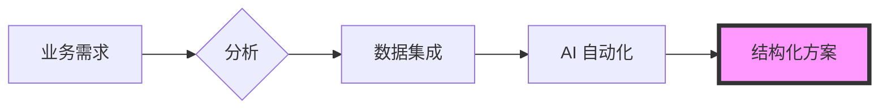

  

 

  <h2><b>衔接业务战略与技术落地</b></h2>
  
清迈大学管理与计算机科学专业毕业在即，专注于数据驱动的决策制定和流程自动化。

 

    
    
    
    
    

 

> [!NOTE]
> **Global Infrastructure Standard:** 以下多数核心项目均基于**标准化的多语言基础设施**构建，提供 5 种语言（英、泰、中、日、韩）的文档和界面，以确保全球用户的易用性和数据完整性。

---

### 📊 精选项目

#### [howmanycals](https://github.com/welltilln/howmanycals)
**AI 驱动的营养师 LINE 机器人**
*   **角色：** 产品负责人 ＆ 数据集成工程师
*   **影响力：** 开发了一款准生产级的视觉 AI 机器人，可将非结构化的食物图像转换为结构化的营养数据。
*   **技术栈：** Python, FastAPI, Google Gemini Vision API, SQLite (持久化存储)
*   **核心成就：** 实现了持久化的每日热量追踪系统及零点自动重置逻辑。

  

#### [fastapi-line-gemini](https://github.com/welltilln/fastapi-line-gemini)
**企业级 AI 机器人开发脚手架**
*   **角色：** 系统架构师
*   **影响力：** 打造了一个可扩展的启动套件，用于将大语言模型集成至即时通讯平台，显著缩短了 AI 工具的开发周期。
*   **技术栈：** Python, Docker, Ngrok, LINE Messaging API
*   **核心成就：** 标准化了 5 种语言的本地化流程。

#### [Yosafe](https://github.com/welltilln/yosafe)
**金融资产追踪与审计系统**
*   **角色：** 后端工程师（私有仓库）
*   **影响力：** 构建了一个高精度的分类账系统用于追踪资产变动，确保了用于审计的 100% 数据可靠性。
*   **技术栈：** SQL (PostgreSQL), Python (TUI), Bash

  

#### [agent-asylum](https://github.com/welltilln/agent-asylum)
**AI Agent 失败案例分析档案**
*   **角色：** 技术分析师
*   **影响力：** 一个记录自主 AI Agent 逻辑死锁与架构失效的协作数据库。
*   **核心成就：** 分析了工具调用工作流中的系统性悖论，提升了系统提示词的鲁棒性。

   

<h1 align="center">技能 (Skills)</h1>

<table align="center" width="100%">
  <tr>
    <td width="33%" valign="top">
      <h3>业务 (Business)</h3>
      <ul>
        <li>业务流程分析</li>
        <li>需求收集</li>
        <li>系统分析与设计</li>
        <li>运营管理</li>
      </ul>
    </td>
    <td width="33%" valign="top">
      <h3>数据 (Data)</h3>
      <ul>
        <li>Python (Pandas)</li>
        <li>SQL (PostgreSQL / SQLite)</li>
        <li>量化分析</li>
        <li>数据集成</li>
      </ul>
    </td>
    <td width="33%" valign="top">
      <h3>技术 (Technical)</h3>
      <ul>
        <li>FastAPI</li>
        <li>Docker</li>
        <li>Bash 脚本</li>
        <li>LLM API 集成</li>
      </ul>
    </td>
  </tr>
</table>

   

<h1 align="center">GitHub 活动</h1>

  
  
   
  

  

<h1 align="center">The Builder Workflow</h1>

  

<i>在管理与数据的交汇处构建结构化解决方案。</i>

