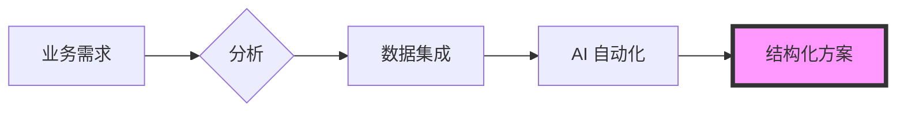

  

 

    
    
    
    
    

  <h2><b>清迈大学管理与计算机科学专业</b></h2>
  
以系统化的方法实现业务流程自动化和数据驱动分析。

 

### howmanycals

一款 AI 驱动的 LINE 官方账号，担任个人营养师。它利用 Google 的 Gemini Vision 扫描食物图片并提取精确的卡路里计数。
* **技术：** Python, FastAPI, Google Gemini API, LINE Messaging API。
* **实现：** 接收图像 Webhook 并使用多模态 AI 模型进行处理，返回结构化的营养数据。

  

**[查看仓库](https://github.com/welltilln/howmanycals)**

---

### fastapi-line-gemini

一个用于集成 Gemini AI 的 LINE 机器人开发脚手架仓库。
* **目的：** 为构建基于消息的 AI 工具提供一个起点，包含完善的环境配置和 API 处理。

**[查看仓库](https://github.com/welltilln/fastapi-line-gemini)**

---

### Yosafe

一个用于跟踪资产变动和财务交易日志的个人工具。
* **功能：** 专为处理高精度数据而构建，采用 PostgreSQL 后端以维护资本资产的集中化真相来源。

  

*私有仓库*

---

### 市场分析工具 (Market Analysis Tools)

用于利用基于逻辑的检测分析市场结构和价格走势趋势的量化脚本。

*私ย仓库*

   

<h1 align="center">技能 (Skills)</h1>

<table align="center" width="100%">
  <tr>
    <td width="33%" valign="top">
      <h3>业务 (Business)</h3>
      <ul>
        <li>业务流程分析</li>
        <li>需求收集</li>
        <li>系统分析与设计</li>
        <li>运营管理</li>
      </ul>
    </td>
    <td width="33%" valign="top">
      <h3>数据 (Data)</h3>
      <ul>
        <li>Python (Pandas)</li>
        <li>SQL (PostgreSQL / SQLite)</li>
        <li>量化分析</li>
        <li>数据集成</li>
      </ul>
    </td>
    <td width="33%" valign="top">
      <h3>技术 (Technical)</h3>
      <ul>
        <li>FastAPI</li>
        <li>Docker</li>
        <li>Bash 脚本</li>
        <li>LLM API 集成</li>
      </ul>
    </td>
  </tr>
</table>

   

<h1 align="center">GitHub 活动</h1>

  
  
   
  

  

<h1 align="center">The Builder Workflow</h1>

  

<i>在管理与数据的交汇处构建结构化解决方案。</i>

